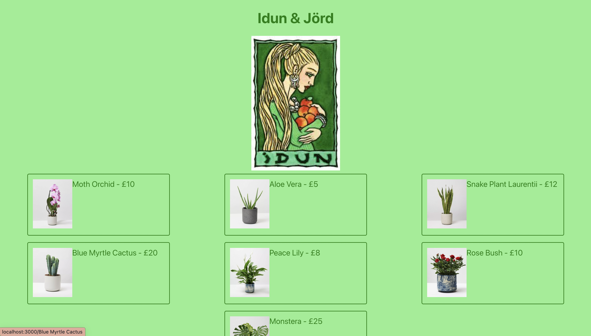

# Idun & Jörd Plant Shop



## Technologies Used

- React used to bootstrap the frontend
- Poetry with Django used for backend
- Python language for backend
- Javascript language for frontend

## Approach Taken

1. Create wireframes to map out user functionality
   
2. Create ERD diagram to map out backend functionality and tables required
   

## Installation Instructions

Please run `poetry install` inside the folder, then nagivate inside the frontend folder and run `npm install` to download dependencies.

## Problems

One part of creating this which really threw me was the forms input. I had attempted to use the format

```
setFormData({ ...formData, name: plant.name });
```

to auto-set the form data, meaning that a user would not have to fill out every field to update a plant. However, this did not seem to work. Eventually I found that the problem was each successive line of code over-wrote the previous one, as the `formData` wasn't yet saved in state, since each was performed within the same render. This was solved by combining all those lines into one single command:

```
setFormData({
        ...formData,
        price: result.price,
        pot_size: result.pot_size,
        light_tolerance: result.light_tolerance,
        soil: result.soil,
        watering_frequency: result.watering_frequency,
        height: result.height,
        category: result.category,
        image: result.image,
        name: result.name,
      });
```
